# PhysicsNeMo AI-Powered Physics Bootcamp — 完整環境建置手冊

> **閱讀說明**：本文件為自給自足的操作手冊，所有指令與設定檔內容皆內嵌於此。
> 在一台全新的 Linux VM（GPU：NVIDIA H200）上，依序執行各步驟即可完成環境建置。
>
> Base image 使用官方 `nvcr.io/nvidia/physicsnemo/physicsnemo`，托管於 **NGC 公開 Catalog，
> 可直接 `docker pull` 無需 API Key 或帳號登入**，與 bootcamp 官方 Dockerfile 一致。
> 教學素材來源：[AI-Powered-Physics-Bootcamp](https://github.com/openhackathons-org/AI-Powered-Physics-Bootcamp)

---

## 前置作業｜在 NCHC 雲平台建立 VM

> 平台網址：[https://ai-cloud.iic.nchc.org.tw/](https://ai-cloud.iic.nchc.org.tw/)

### NCHC-1. 登入平台

前往 [https://ai-cloud.iic.nchc.org.tw/](https://ai-cloud.iic.nchc.org.tw/) 登入，確認專案名稱為 **NCHC-NVIDIA Joint Lab 教育訓練**（專案 ID：GOV114072）。

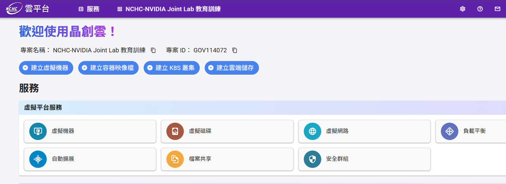

### NCHC-2. 建立安全群組

在首頁（如 NCHC-1 截圖）服務區塊中，點擊 **「安全群組」**，進入「安全群組管理」頁面，點擊 **「+ 建立」**。


進入「建立安全群組」頁面，**名稱**欄位保留預設值（例如 `sg1772642623211`），點擊 **「下一步：規則設定 >」**。

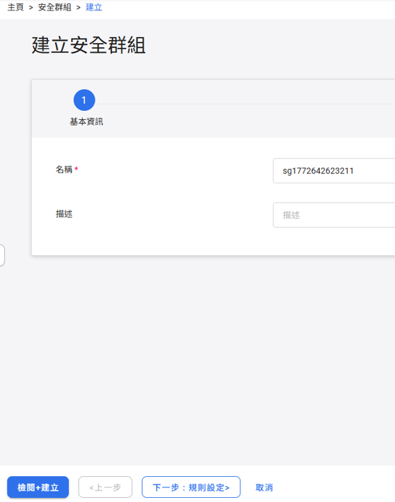

進入規則設定頁面，預設已有一條 `egress ipv4` 規則。點擊 **「新增安全群組規則」**。

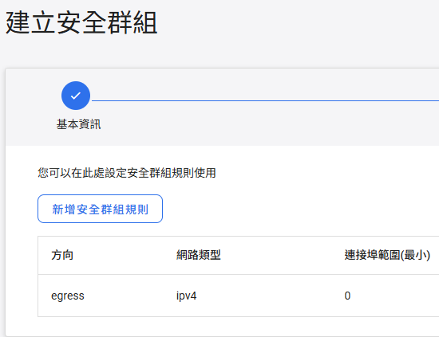

新增 **SSH（port 22）** 規則，欄位填寫如下：

| 欄位 | 填寫內容 |
|------|---------|
| 方向 | `ingress` |
| 連接埠範圍（最小）| `22` |
| 連接埠範圍（最大）| `22` |
| 協定 | `tcp` |
| CIDR | 填入當下使用者的 IP（見下方說明） |

> **如何取得 CIDR？**
> 1. 前往 [https://www.whatismyip.com.tw/en/](https://www.whatismyip.com.tw/en/) 查詢目前的公開 IP（例如 `123.123.123.45`）
> 2. 若只允許單一 IP 連線：填入 `123.123.123.45/32`
> 3. 若允許整個網段（例如辦公室 IP 範圍）：填入 `123.123.123.0/24`

填寫完成後點擊 **「確定」**。


規則新增完成後，清單中應出現 `egress` 與 `ingress port 22` 兩條規則。確認後點擊 **「下一步：檢閱+建立 >」**。

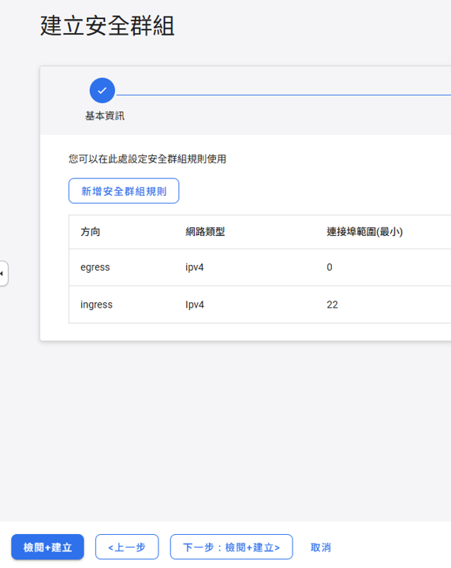

確認名稱與規則（egress + ingress port 22）無誤後，點擊左下角 **「建立」**。

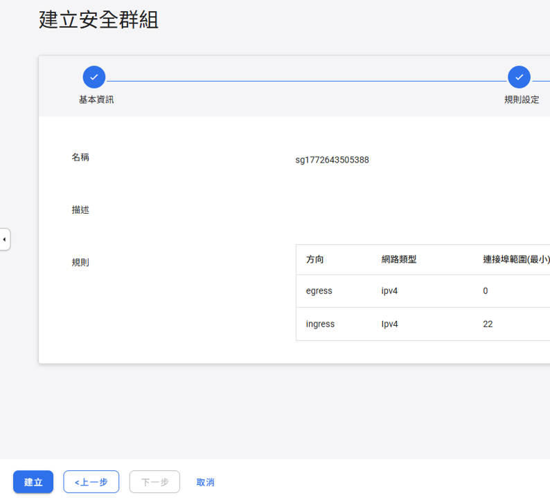

安全群組建立完成。

### NCHC-3. 進入虛擬機器管理頁面

在左側選單點擊 **虛擬機器 → 虛擬機器管理**，進入管理頁面後點擊 **「+ 建立」**。

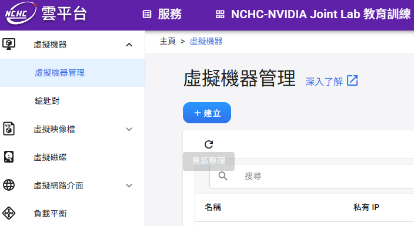

### NCHC-4. 基本設定

進入「建立虛擬機器」頁面，共分六步驟：**基本設定 → 硬體設定 → 虛擬網路 → 儲存資訊 → 認證 → 初始化指令**。

**基本設定**欄位填寫如下：

| 欄位 | 填寫內容 |
|------|---------|
| 名稱 | 自訂（例如 `vm1772640765`） |
| 描述 | （選填） |
| 映像檔來源 | 點擊「選擇」→ 選擇 **Ubuntu** |
| 映像檔標籤 | **24.04** |

填寫完成後，確認如圖所示，點擊 **「下一步：硬體設定 >」**。

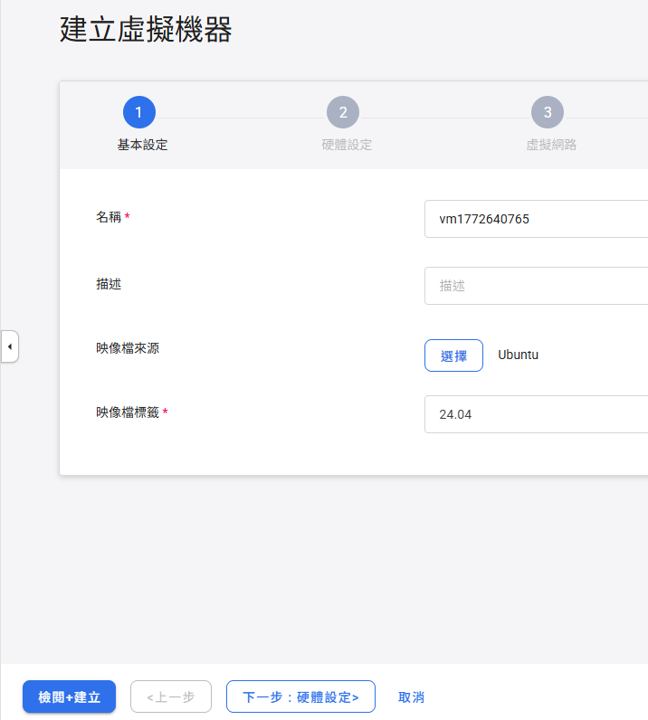

### NCHC-5. 硬體設定

選擇型號 **`GPU.small`**，點擊 **「下一步：虛擬網路 >」**。

| 型號 | GPU 型號 | GPU（張）| CPU（Cores）| 記憶體（GiB）| 開機磁碟（GiB）|
|------|---------|---------|------------|------------|--------------|
| GPU.large | H200 | 2 | 192 | 1024 | 120 |
| **GPU.small** ✅ | **H200** | **1** | **96** | **512** | **120** |
| CPU.medium | - | 0 | 16 | 32 | 120 |

> **為何選 GPU.small？** PhysicsNeMo 需要 NVIDIA H200 GPU（建議 ≥ 20 GB VRAM）、≥ 32 GB RAM、Ubuntu 22.04+、可連外網路。GPU.small 提供 H200 × 1、512 GiB RAM、Ubuntu 24.04，完全符合需求。


### NCHC-6. 虛擬網路設定

進入「虛擬網路」步驟，清單顯示 `No data available`，需至少新增一張虛擬網卡。點擊 **「新增虛擬網卡」**。


在「新增虛擬網卡」對話框中填寫：

| 欄位 | 填寫內容 |
|------|---------|
| 虛擬網路 | `bootcamp` |
| 安全群組 | 選擇剛才建立的安全群組（例如 `sg1772643505388`） |

填寫完成後點擊 **「確定」**。


確認清單出現 `bootcamp` 網路及對應安全群組後，點擊 **「下一步：儲存資訊 >」**。

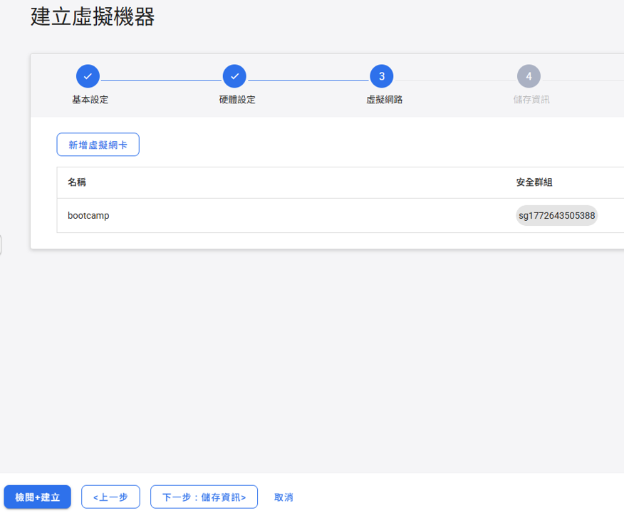

### NCHC-7. 儲存資訊（建立虛擬磁碟）

進入「儲存資訊」步驟，點擊 **「建立虛擬磁碟」**。

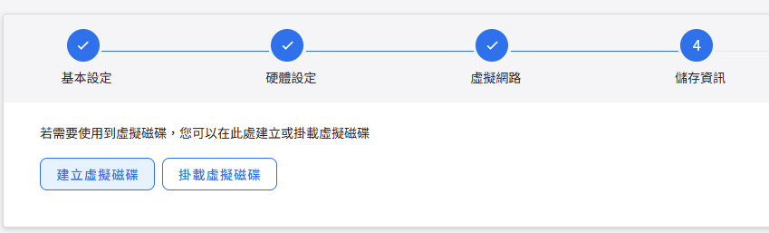

在「建立虛擬磁碟」對話框中填寫：

| 欄位 | 填寫內容 |
|------|---------|
| 名稱 | 保留預設（例如 `vol1772681329`） |
| 描述 | （選填） |
| 容量（GiB） | **100** |
| 類型 | `SSD` |

填寫完成後點擊 **「確定」**。

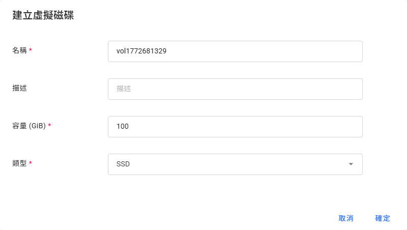

確認清單出現磁碟名稱與容量（100 GiB）後，點擊 **「下一步：認證 >」**。

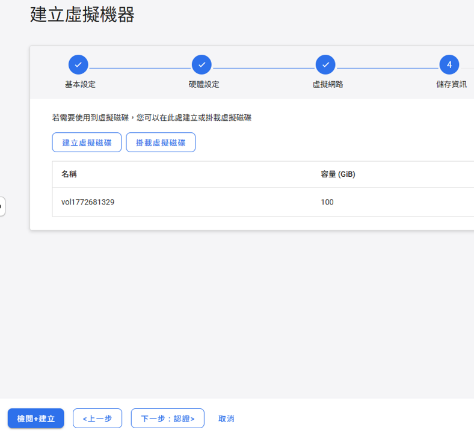

### NCHC-8. 認證設定

進入「認證」步驟：

| 欄位 | 填寫內容 |
|------|---------|
| 鑰匙對認證 | **停用** |
| 密碼 | `NCHCbootcamp2026_` |

> ⚠️ **請務必記住此密碼**，後續 SSH 連線至 VM 時會需要輸入。

密碼設定完成後，點擊 **「下一步：初始化指令 >」**。


### NCHC-9. 初始化指令

「初始化指令」欄位保留空白，直接點擊 **「下一步：檢閱+建立 >」**。


### NCHC-10. 檢閱並建立 VM

進入最後的「檢閱+建立」步驟，確認以下設定無誤：

| 項目 | 確認內容 |
|------|---------|
| 名稱 | `vm...`（自動產生） |
| 映像檔來源 | `Ubuntu` |
| 映像檔標籤 | `24.04` |
| 硬體設定 | `GPU.small` |
| 虛擬網路 | `bootcamp` + 安全群組 |

確認後點擊左下角 **「建立」**。


### NCHC-11. 等待 VM 啟動並取得 IP

建立後回到「虛擬機器管理」頁面，等待數分鐘，狀態由 `build` 變為 **`active`** 即表示 VM 已就緒。

點擊 VM 名稱進入詳細頁面，後續步驟將在此取得**浮動 IP**。


進入 VM 詳細資料頁面，確認：
- **狀態**：`active`
- **登入帳號**：`ubuntu`

在「虛擬網路資訊」區塊中，點擊 `bootcamp` 列右側的 **「⋮」** 按鈕，選擇 **「配置浮動 IP」**。


在「配置浮動 IP」對話框中選擇 **「自動配置浮動 IP」**，點擊 **「確定」**。

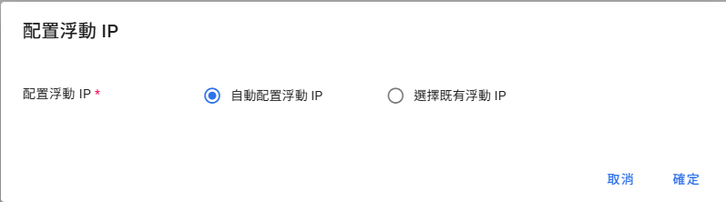

配置完成後，虛擬網路資訊欄位會顯示 **浮動 IP**（例如 `140.110.108.39`），此即為從外部 SSH 連線時使用的 IP。

> ⚠️ **請記下或複製此浮動 IP**，下一步 SSH 連線時會需要用到。

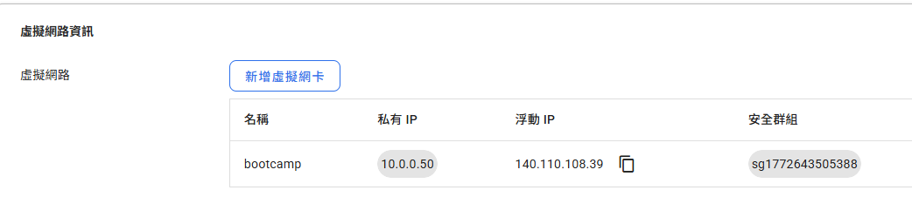

### NCHC-12. SSH 連線至 VM

**先在本機開啟 Terminal：**

| 平台 | 開啟方式 |
|------|---------|
| **Windows** | 開始選單搜尋 `PowerShell` 或 `cmd`，或安裝 [Windows Terminal](https://aka.ms/terminal) |
| **macOS** | `Spotlight`（`⌘ + Space`）搜尋 `Terminal`，或至「應用程式 → 工具程式 → 終端機」 |
| **Linux** | 快捷鍵 `Ctrl + Alt + T`，或在應用程式選單中搜尋 `Terminal` |

> Windows 10/11 內建的 PowerShell 與 cmd 均支援 `ssh` 指令，無需額外安裝。

使用浮動 IP 從本機連線至 VM：

```bash
ssh ubuntu@<浮動IP>
```

例如：

```bash
ssh ubuntu@140.110.108.39
```

輸入建立 VM 時設定的**密碼**即可登入。

> 密碼：`NCHCbootcamp2026_`

---

## 流程總覽

```
步驟 1  確認 GPU 可見
步驟 2  安裝 NVIDIA Driver（如未安裝）
步驟 3  安裝 Docker Engine
步驟 4  安裝 NVIDIA Container Toolkit
步驟 5  設定 Docker daemon 支援 GPU
步驟 6  建立工作目錄
步驟 7  Clone bootcamp 教材
步驟 8  建立 Dockerfile
步驟 9  建置 Docker Image
步驟 10 啟動 JupyterLab
步驟 11 開始上機教學
```

---

## 步驟 1｜確認 GPU 可見

```bash
lspci | grep -i nvidia
```

預期輸出：

```
06:00.0 3D controller: NVIDIA Corporation Device 233b (rev a1)
```

> `3D controller`（非 `VGA compatible controller`）是資料中心 GPU 的正常顯示方式。
> Device ID `233b` 對應 H200 NVL。若無任何輸出，請確認 VM 已正確配置 GPU passthrough。

---

## 步驟 2｜安裝 NVIDIA Driver

### 2-1. 確認目前是否已安裝 Driver

```bash
nvidia-smi
```

- 若指令執行成功且 Driver Version ≥ 535，**跳至步驟 3**。
- 若指令不存在或版本過舊，繼續以下步驟。

### 2-2. 更新系統並安裝必要工具

```bash
sudo apt-get update && sudo apt-get upgrade -y
sudo apt-get install -y \
    build-essential \
    curl wget git \
    software-properties-common \
    linux-headers-$(uname -r)
```

> `linux-headers-$(uname -r)` 為必要項目：NVIDIA driver 透過 DKMS 編譯核心模組時需要對應的 kernel headers，
> 若缺少此套件，driver 安裝後 `nvidia-smi` 仍會失敗。

### 2-3. 安裝 Driver

Ubuntu 22.04 / 24.04 的預設 repo 已內建 nvidia-driver-570，**不需要加 PPA**：

```bash
sudo apt-get install -y nvidia-driver-570
```

### 2-4. 重新開機（Driver 安裝後必須重開機）

```bash
sudo reboot
```

> 重開機後 VM 需要約 **1–2 分鐘**才會重新接受 SSH 連線，請稍候再重新登入。
> 登入密碼：`NCHCbootcamp2026_`

### 2-5. 重開機後確認 Driver 安裝成功

```bash
nvidia-smi
```

預期輸出範例：

```
+-----------------------------------------------------------------------------------------+
| NVIDIA-SMI 570.211.01             Driver Version: 570.211.01     CUDA Version: 12.8     |
|-----------------------------------------+------------------------+----------------------+
| GPU  Name                 Persistence-M | Bus-Id          Disp.A | Volatile Uncorr. ECC |
| Fan  Temp   Perf          Pwr:Usage/Cap |           Memory-Usage | GPU-Util  Compute M. |
|=========================================+========================+======================|
|   0  NVIDIA H200 NVL                Off |   00000000:06:00.0 Off |                    0 |
| N/A   33C    P0             69W /  600W |       0MiB / 143771MiB |      0%      Default |
+-----------------------------------------+------------------------+----------------------+
```

---

## 步驟 3｜安裝 Docker Engine

### 3-1. 移除舊版（若存在）

```bash
sudo apt-get remove -y docker docker-engine docker.io containerd runc 2>/dev/null || true
```

### 3-2. 設定 Docker 官方 APT repository

```bash
sudo apt-get install -y ca-certificates gnupg lsb-release
sudo install -m 0755 -d /etc/apt/keyrings

curl -fsSL https://download.docker.com/linux/ubuntu/gpg \
    | sudo gpg --dearmor -o /etc/apt/keyrings/docker.gpg
sudo chmod a+r /etc/apt/keyrings/docker.gpg

echo \
  "deb [arch=$(dpkg --print-architecture) \
  signed-by=/etc/apt/keyrings/docker.gpg] \
  https://download.docker.com/linux/ubuntu \
  $(lsb_release -cs) stable" \
  | sudo tee /etc/apt/sources.list.d/docker.list > /dev/null
```

### 3-3. 安裝 Docker Engine

```bash
sudo apt-get update
sudo apt-get install -y \
    docker-ce \
    docker-ce-cli \
    containerd.io \
    docker-buildx-plugin \
    docker-compose-plugin
```

### 3-4. 啟動並設定 Docker 開機自動啟動

```bash
sudo systemctl start docker
sudo systemctl enable docker
```

### 3-5. 將目前使用者加入 docker 群組（避免每次都需 sudo）

```bash
sudo usermod -aG docker $USER
```

> 群組變更需**重新登入 SSH** 才會生效。

登出目前 session：

```bash
exit
```

重新 SSH 登入後，再繼續以下步驟。

> 密碼：`NCHCbootcamp2026_`

### 3-6. 確認 Docker 安裝成功

```bash
docker --version
docker run --rm hello-world
```

預期 `docker --version` 輸出：

```
Docker version 29.2.1, build a5c7197
```

---

## 步驟 4｜安裝 NVIDIA Container Toolkit

此工具讓 Docker container 可以存取 Host 的 GPU。

### 4-1. 加入 NVIDIA Container Toolkit repository

```bash
curl -fsSL https://nvidia.github.io/libnvidia-container/gpgkey \
    | sudo gpg --dearmor -o /usr/share/keyrings/nvidia-container-toolkit-keyring.gpg

curl -s -L https://nvidia.github.io/libnvidia-container/stable/deb/nvidia-container-toolkit.list \
    | sed 's#deb https://#deb [signed-by=/usr/share/keyrings/nvidia-container-toolkit-keyring.gpg] https://#g' \
    | sudo tee /etc/apt/sources.list.d/nvidia-container-toolkit.list
```

### 4-2. 安裝

```bash
sudo apt-get update
sudo apt-get install -y nvidia-container-toolkit
```

### 4-3. 確認安裝版本

```bash
nvidia-ctk --version
```

預期輸出：

```
NVIDIA Container Toolkit CLI version 1.18.2
```

---

## 步驟 5｜設定 Docker daemon 支援 GPU

### 5-1. 寫入 Docker daemon 設定檔

```bash
sudo tee /etc/docker/daemon.json > /dev/null << 'EOF'
{
  "default-runtime": "nvidia",
  "runtimes": {
    "nvidia": {
      "path": "/usr/bin/nvidia-container-runtime",
      "runtimeArgs": []
    }
  },
  "log-driver": "json-file",
  "log-opts": {
    "max-size": "100m",
    "max-file": "3"
  }
}
EOF
```

### 5-2. 重啟 Docker daemon 使設定生效

```bash
sudo systemctl restart docker
```

### 5-3. 驗證 GPU 在 Docker 內可見

```bash
docker run --rm --gpus all \
    nvidia/cuda:12.4.0-base-ubuntu22.04 \
    nvidia-smi --query-gpu=name,memory.total --format=csv,noheader
```

預期輸出：

```
NVIDIA H200 NVL, 143771 MiB
```

---

## 步驟 6｜建立工作目錄

```bash
mkdir -p ~/physicsnemo-workshop
cd ~/physicsnemo-workshop
```

後續所有檔案都建立在此目錄內。

---

## 步驟 7｜Clone bootcamp 教材

將教材 clone 至家目錄，後續透過 volume mount 掛入 container，修改的內容在 container 關閉後仍會保留。

```bash
cd ~
git clone https://github.com/openhackathons-org/AI-Powered-Physics-Bootcamp.git
```

---

## 步驟 8｜建立 Dockerfile

以下 Dockerfile 以 bootcamp 官方 Dockerfile 為基礎，加入 JupyterLab 設定。
Base image `nvcr.io/nvidia/physicsnemo/physicsnemo` 托管於 NGC 公開 Catalog，
**直接 pull 即可，不需要 API Key**，且已內含完整 PhysicsNeMo、PhysicsNeMo-Sym（PINNs）與所有 CUDA 依賴。

直接複製整段貼到 terminal 執行：

```bash
cat > ~/physicsnemo-workshop/Dockerfile << 'DOCKERFILE_EOF'
# ============================================================
# PhysicsNeMo AI-Powered Physics Bootcamp
# Base: nvcr.io/nvidia/physicsnemo/physicsnemo:25.06
#   → NGC 公開 Catalog，docker pull 無需 API Key
#   → 已內含 PhysicsNeMo、PhysicsNeMo-Sym（PINNs）、CUDA 完整環境
# JupyterLab on port 8888
# ============================================================

ARG PHYSICSNEMO_VERSION=25.06
FROM nvcr.io/nvidia/physicsnemo/physicsnemo:${PHYSICSNEMO_VERSION}

# ── 額外系統工具 ──────────────────────────────────────────────
USER root
RUN apt-get update && apt-get install -y --no-install-recommends \
        git \
        wget \
        curl \
        vim \
    && apt-get clean \
    && rm -rf /var/lib/apt/lists/*

# ── Bootcamp 額外 Python 依賴 ─────────────────────────────────
RUN pip install --no-cache-dir \
        gdown \
        ipympl \
        cdsapi \
        jupyterlab>=4.0 \
        ipywidgets \
    && pip install --no-cache-dir --upgrade nbconvert

# ── JupyterLab 設定 ───────────────────────────────────────────
RUN mkdir -p /root/.jupyter && \
    cat > /root/.jupyter/jupyter_lab_config.py << 'EOF'
c.ServerApp.ip = '0.0.0.0'
c.ServerApp.port = 8888
c.ServerApp.open_browser = False
c.ServerApp.allow_root = True
c.IdentityProvider.token = ''
c.ServerApp.password = ''
c.ServerApp.root_dir = '/workspace/AI-Powered-Physics-Bootcamp'
c.ServerApp.allow_origin = '*'
EOF

# ── Expose ports ─────────────────────────────────────────────
EXPOSE 8888 8889

WORKDIR /workspace

CMD ["jupyter", "lab", "--ip=0.0.0.0", "--port=8888", "--no-browser", "--allow-root"]
DOCKERFILE_EOF
```

確認檔案已建立：

```bash
cat ~/physicsnemo-workshop/Dockerfile
```

---

## 步驟 9｜建置 Docker Image

```bash
docker build -t physicsnemo-bootcamp:25.06 ~/physicsnemo-workshop/
```

**預期耗時**：首次建置約 **10–15 分鐘**，主要耗時於：
- 下載 `nvcr.io/nvidia/physicsnemo/physicsnemo:25.06` base image（約 15 GB）
- 安裝少量額外 pip 套件（gdown、ipympl、jupyterlab 等）

建置過程中各階段說明：

| 階段 | 說明 |
|------|------|
| `FROM nvcr.io/nvidia/physicsnemo` | 下載官方 NGC 公開 image（含完整 PhysicsNeMo + CUDA） |
| `apt-get install` | 安裝 vim、curl 等工具 |
| `pip install gdown ipympl ...` | 安裝 bootcamp 額外依賴（數量少，速度快） |

建置完成後確認 image 存在：

```bash
docker images | grep physicsnemo-bootcamp
```

預期輸出：

```
WARNING: This output is designed for human readability. For machine-readable output, please use --format.
physicsnemo-bootcamp:25.06   <IMAGE_ID>   ...   49.2GB   16.9GB
```

> WARNING 為 Docker 的正常提示訊息（輸出至 stderr），非錯誤，可忽略。

---

## 步驟 10｜啟動 JupyterLab

### 10-1. 背景啟動容器

**首次啟動**（尚未建立過容器）：

```bash
docker run -d \
  --name physicsnemo-bootcamp \
  --gpus all \
  --ipc=host \
  --ulimit memlock=-1 \
  --ulimit stack=67108864 \
  -p 8888:8888 \
  -p 8889:8889 \
  -e NVIDIA_VISIBLE_DEVICES=all \
  -e NVIDIA_DRIVER_CAPABILITIES=compute,utility \
  -v ~/AI-Powered-Physics-Bootcamp:/workspace/AI-Powered-Physics-Bootcamp \
  physicsnemo-bootcamp:25.06
```

> **容器已存在時**（例如 VM 重開機後）：`docker run` 會因名稱衝突而報錯。
> 請改用以下指令重新啟動已存在的容器：
>
> ```bash
> docker start physicsnemo-bootcamp
> ```

### 10-2. 確認容器正常運行

```bash
docker ps
```

預期輸出（`STATUS` 顯示 `Up` 代表容器正在運行）：

```
CONTAINER ID   IMAGE                        COMMAND                  CREATED         STATUS         PORTS                                                                       NAMES
xxxxxxxxxxxx   physicsnemo-bootcamp:25.06   "/opt/nvidia/physic…"    X seconds ago   Up X seconds   6006/tcp, 0.0.0.0:8888-8889->8888-8889/tcp, [::]:8888-8889->8888-8889/tcp   physicsnemo-bootcamp
```

### 10-3. 查看啟動日誌

```bash
docker logs -f physicsnemo-bootcamp
```

看到以下訊息代表 JupyterLab 已就緒，按 `Ctrl+C` 離開 log 追蹤：

```
DEPRECATION: Loading egg at /usr/local/lib/python3.12/dist-packages/dill-...
DEPRECATION: Loading egg at /usr/local/lib/python3.12/dist-packages/lightning_thunder-...
...（數行 DEPRECATION，可忽略）

========================
== NVIDIA PhysicsNeMo ==
========================

NVIDIA Release 25.06 (build 29613739)
PhysicsNeMo PyPi Version 1.1.0 (Git Commit: b7dd246)
PhysicsNeMo Sym PyPi Version 2.1.0 (Git Commit: 416de0a)
...
NOTE: CUDA Forward Compatibility mode ENABLED.
  Using CUDA 12.9 driver version 575.51.02 with kernel driver version 570.211.01.
...
[W 2026-xx-xx xx:xx:xx.xxx ServerApp] All authentication is disabled.  Anyone who can connect to this server will be able to run code.
...
[I 2026-xx-xx xx:xx:xx.xxx ServerApp] Serving notebooks from local directory: /workspace/AI-Powered-Physics-Bootcamp
[I 2026-xx-xx xx:xx:xx.xxx ServerApp] Jupyter Server 2.15.0 is running at:
[I 2026-xx-xx xx:xx:xx.xxx ServerApp] http://hostname:8888/lab
[I 2026-xx-xx xx:xx:xx.xxx ServerApp]     http://127.0.0.1:8888/lab
```

> 啟動時出現的 `DEPRECATION` 與 `UserWarning` 為已知提示，不影響功能，可忽略。
> `All authentication is disabled` 表示無需密碼或 token，可直接開啟瀏覽器存取。

### 10-4. 開啟瀏覽器（SSH tunnel）

在本機**另開一個新的 terminal**，建立 SSH tunnel：

```bash
ssh -L 8888:localhost:8888 ubuntu@<VM_IP>
```

輸入密碼後會出現遠端 shell 提示符（`ubuntu@vm:~$`），**保持此 terminal 開啟**，tunnel 即持續運作。

> 密碼：`NCHCbootcamp2026_`

在本機瀏覽器開啟：

```
http://localhost:8888
```

> 結束使用後，在該 terminal 輸入 `exit` 即可關閉 tunnel 並登出 VM。

> **若為 Cloud VM**（AWS / Azure / GCP）且可直接存取 VM public IP：
> 請在 Security Group / Firewall Rules 中開放 TCP port 8888 的 Inbound 流量，
> 然後直接在瀏覽器輸入 `http://<VM_IP_ADDRESS>:8888`。

---

## 步驟 11｜開始上機教學

進入 JupyterLab 後，在左側檔案瀏覽器找到並開啟 **`Start_Here.ipynb`**：

```
/workspace/AI-Powered-Physics-Bootcamp/
├── Start_Here.ipynb              ← 從這裡開始
│
├── tutorial/                      Tutorial（約 2 小時）
│   ├── Lab1_intro_to_pinn/        Physics-Informed Neural Networks (PINNs)
│   ├── Lab2_ode_pde/              求解 ODE / PDE
│   ├── Lab3_diffusion/            Diffusion 問題
│   └── Lab4_advanced_pde/        進階 PDE 系統
│
└── challenge/                     Challenge（約 4 小時）
    ├── Challenge1_wave/           波動方程 (Wave dynamics)
    ├── Challenge2_darcy/          Darcy flow
    ├── Challenge3_fourcastnet/    FourCastNet 天氣預報
    └── Challenge4_mhd/           磁流體動力學 (MHD)
```

**建議教學順序**：Tutorial（2h）→ Challenge（4h），合計約 6 小時

---

## 常用指令速查

```bash
# ── 容器管理 ──────────────────────────────────────────────
# 首次啟動（容器不存在時）
docker run -d \
  --name physicsnemo-bootcamp \
  --gpus all --ipc=host \
  --ulimit memlock=-1 --ulimit stack=67108864 \
  -p 8888:8888 -p 8889:8889 \
  -e NVIDIA_VISIBLE_DEVICES=all \
  -e NVIDIA_DRIVER_CAPABILITIES=compute,utility \
  -v ~/AI-Powered-Physics-Bootcamp:/workspace/AI-Powered-Physics-Bootcamp \
  physicsnemo-bootcamp:25.06

# 停止容器
docker stop physicsnemo-bootcamp

# 重新啟動已存在的容器（VM 重開機後使用）
docker start physicsnemo-bootcamp

# 移除容器（停止後才可執行）
docker rm physicsnemo-bootcamp

# ── 狀態查看 ──────────────────────────────────────────────
docker ps
docker logs -f physicsnemo-bootcamp

# ── 進入容器 terminal ─────────────────────────────────────
docker exec -it physicsnemo-bootcamp bash

# ── GPU 監控 ──────────────────────────────────────────────
# Host 上即時監控
watch -n 1 nvidia-smi

# 容器內監控（在 JupyterLab terminal 執行）
nvidia-smi dmon -s pucvmet

# ── 重新 build image ──────────────────────────────────────
docker build --no-cache -t physicsnemo-bootcamp:25.06 ~/physicsnemo-workshop/
```

---

## 疑難排解

### GPU 無法在容器內存取

**錯誤訊息**：`could not select device driver "nvidia" with capabilities: [[gpu]]`

```bash
sudo nvidia-ctk runtime configure --runtime=docker
sudo systemctl restart docker
```

---

### Driver 版本不匹配

**錯誤訊息**：`Failed to initialize NVML: Driver/library version mismatch`

```bash
sudo reboot
```

---

### 無法 pull base image（unauthorized）

**錯誤訊息**：`unauthorized: authentication required`

NGC 公開 Catalog image 偶爾會更新版本，舊版仍可直接 pull，新版若遇到此錯誤，
可至 [NGC Catalog](https://catalog.ngc.nvidia.com/orgs/nvidia/teams/physicsnemo/containers/physicsnemo)
確認仍公開的 tag，或免費註冊 NGC 帳號後執行：

```bash
docker login nvcr.io -u '$oauthtoken' -p <YOUR_NGC_API_KEY>
```

---

### JupyterLab 無法從外部存取

```bash
# Ubuntu ufw 防火牆
sudo ufw allow 8888/tcp
sudo ufw reload
sudo ufw status
```

Cloud VM 請在 Security Group / Firewall Rules 中開放 TCP port 8888 inbound。

---

### 容器記憶體不足（OOM）

確認 `docker run` 指令包含以下參數：

```bash
--ipc=host
--ulimit memlock=-1
--ulimit stack=67108864
```

---

## 版本更新說明

| Image Tag | CUDA 版本 | 狀態 |
|-----------|----------|------|
| `25.06` | 12.4 | 穩定，本手冊預設版本 |
| `25.08` | 12.5 | 穩定 |
| `25.11` | 12.6 | 最新版（注意：`onnxruntime-gpu` 尚不支援 CUDA 13.x） |

**切換版本**：重新 build 時指定新的 tag：

```bash
docker build --build-arg PHYSICSNEMO_VERSION=25.11 -t physicsnemo-bootcamp:25.11 ~/physicsnemo-workshop/
```

可用 tag 清單請至 [NGC Catalog](https://catalog.ngc.nvidia.com/orgs/nvidia/teams/physicsnemo/containers/physicsnemo) 確認。

---

## TA 工具｜一鍵自動安裝腳本

> 適用情境：TA 需要快速重建環境、或補課學員需要從頭設置時使用。

SSH 登入 VM 後，執行以下指令：

```bash
git clone https://github.com/kevin5826536/physicsnemo_bootcamp_setup.git
cd physicsnemo_bootcamp_setup
bash setup.sh
```

Script 會自動完成步驟 1–10，包含：
- 確認 GPU、安裝 Driver（若需要）、安裝 Docker 與 NVIDIA Container Toolkit
- Clone bootcamp 教材、建立 Dockerfile、build image、啟動 JupyterLab

> **若 NVIDIA Driver 尚未安裝**：script 安裝完成後會提示 `sudo reboot`。
> 重開機並重新 SSH 登入後，**再次執行 `bash setup.sh`** 即可從中斷處繼續。

> Script 為冪等設計，已完成的步驟會自動略過，可安全重複執行。

---

## 參考資料

- [NVIDIA PhysicsNeMo 官方文件](https://docs.nvidia.com/physicsnemo/latest/)
- [NGC PhysicsNeMo Container Catalog](https://catalog.ngc.nvidia.com/orgs/nvidia/teams/physicsnemo/containers/physicsnemo)
- [AI-Powered Physics Bootcamp GitHub](https://github.com/openhackathons-org/AI-Powered-Physics-Bootcamp)
- [Bootcamp 官方 Dockerfile](https://github.com/openhackathons-org/AI-Powered-Physics-Bootcamp/blob/main/Dockerfile)
- [NVIDIA Container Toolkit 安裝指南](https://docs.nvidia.com/datacenter/cloud-native/container-toolkit/install-guide.html)
